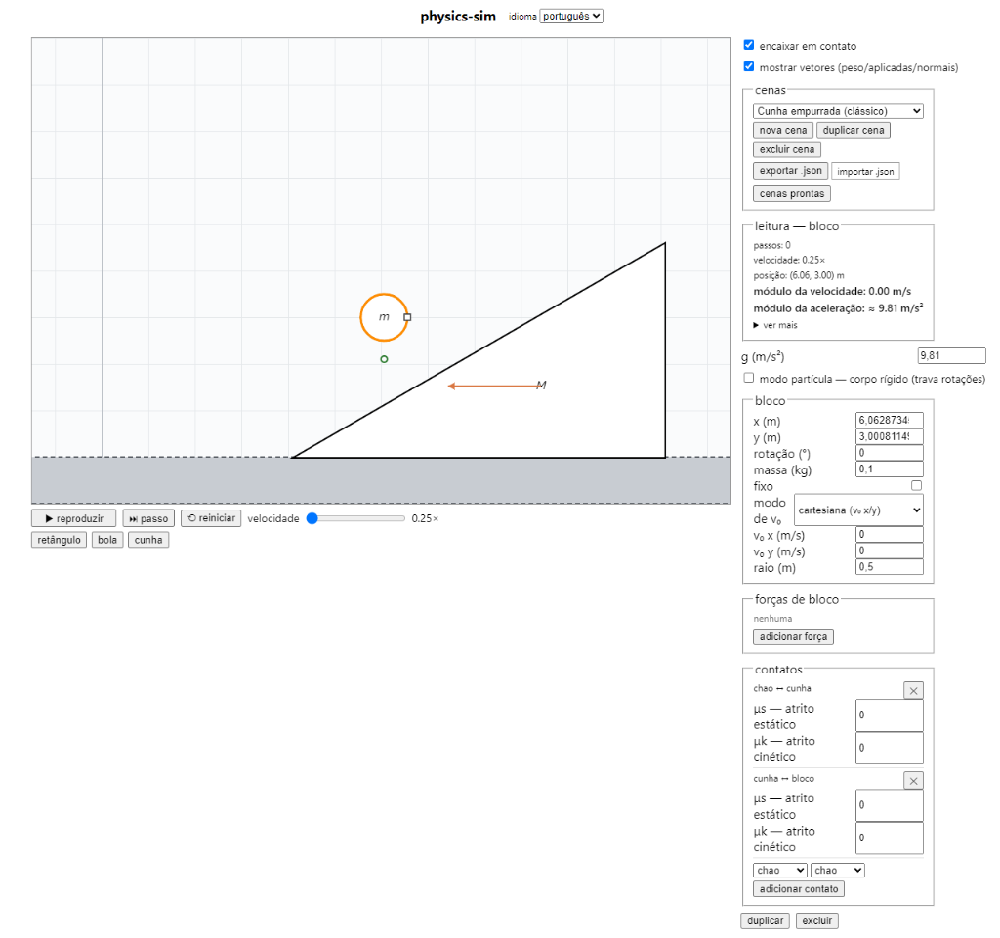

# PhysiSyst

**[Abrir o simulador](https://laginho.github.io/PhysiSyst/)** — publicado automaticamente a cada push em `main` via GitHub Actions, após os quatro portões (`test`, `lint`, `typecheck`, `build`) passarem.

Simulador 2D interativo de mecânica clássica voltado para problemas típicos de livro-texto (planos inclinados, blocos, cunhas, atrito, cordas, polias e molas).

O projeto permite montar cenários físicos livremente, definir parâmetros numéricos (massa, forças aplicadas, coeficientes de atrito) e observar o movimento resultante com fidelidade analítica.



## O que o simulador faz

- **Composição de corpos:** criação e ajuste de blocos (retângulos), esferas e cunhas (triângulos), com controle de posição, dimensões, rotação, massa e opção de corpo fixo (chão ou paredes).
- **Forças e velocidade inicial:** aplicação de forças com intensidade e ângulo arbitrários ancoradas nos corpos, além de velocidade inicial ($v_0$) em formato cartesiano ou polar.
- **Contatos e atrito:** ajuste individual de coeficientes de atrito estático ($\mu_s$) e cinético ($\mu_k$) para cada par de superfícies em contato.
- **Vínculos:** cordas ideais (inextensíveis, sem massa, afrouxam quando não puxam) que passam por uma sequência de polias; polias fixas ou móveis, montadas em qualquer corpo, com massa opcional; molas com rigidez $k$, comprimento natural $x_0$, amortecimento $c$ e massa opcional. Pêndulo é uma corda presa num corpo fixo. As pontas se encaixam no centro de massa, no meio de uma face ou num vértice (*Anchor snap*), e "comprimida de 5 cm" é um campo só ($\Delta x$).
- **Vetores na tela:** visualização em tempo real do peso, das forças aplicadas, das normais, da tração ($T$) e da força elástica ($F_{el}$), cada seta com a sua letra ($P$, $N$, $F$, $T$, $F_{el}$, $v_0$; em inglês $W$ e $F_s$), numerada quando há duas do mesmo tipo. O painel de leitura mostra $T$, $F_{el}$ e $\Delta x$ da corda ou mola selecionada.
- **Modo partícula vs. corpo rígido:** opção para travar rotações quando se deseja simular problemas que tratam os corpos como pontos materiais.
- **Leitura em tempo real:** painel com passos de simulação, posição, módulo da velocidade e aceleração instantânea calculada a cada instante.
- **Controle de tempo:** reprodução contínua, passo a passo individual, reinício e controle de velocidade da simulação (0.25x até 2x).
- **Cenas e presets:** galeria em árvore (área → parte → tópico, seguindo o *Tópicos de Física*) com doze cenas prontas, entre elas a cunha empurrada, a máquina de Atwood, o bloco na mesa com bloco pendurado, a polia móvel, os pêndulos e três massa-mola. A galeria mostra só os nós que têm preset. Também dá para salvar, duplicar e exportar/importar cenas em JSON.
- **Interface bilíngue:** suporte nativo a português (pt-BR) e inglês (en-US).

## Como rodar localmente

Pré-requisitos: Node.js (v18+) e npm.

```bash
# Clone o repositório
git clone https://github.com/Laginho/PhysiSyst.git
cd PhysiSyst

# Instale as dependências
npm install

# Inicie o servidor de desenvolvimento
npm run dev
```

O Vite abrirá um servidor local, geralmente em `http://localhost:5173`.

### Comandos úteis

```bash
# Rodar suíte de testes (Vitest)
npm test

# Checagem de tipos e lint
npm run typecheck
npm run lint

# Gerar build de produção
npm run build
```

## Stack

- **Interface:** React 19 + TypeScript
- **Build:** Vite
- **Física:** [Rapier2D](https://rapier.rs/) (`@dimforge/rapier2d-compat` via WebAssembly), com resolução determinística em timestep fixo (1/60s)
- **Renderização:** Canvas 2D nativo
- **Testes:** Vitest (com validação contra soluções analíticas de mecânica clássica)
